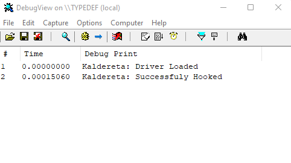

    

<h1 align="center">Kaldereta</h1>

    Unsigned Kernel Mode Driver that does memory modifications

## Features

<ul>
    <li>Base Address/Image Size</li>
    <li>Protection</li>
    <li>Allocation</li>
    <li>Free Memory</li>
    <li>Read/Write</li>
    <li>Read/Write String</li>
    <li>Mouse Event</li>
    <li>Keyboard Event</li>
</ul>

## Setup

Install [Windows Driver Kit](https://docs.microsoft.com/en-us/windows-hardware/drivers/download-the-wdk)

Load .sys file with [KDMapper](https://github.com/TheCruZ/kdmapper)

## Support

If you need help with anything please contact us on [Discord](https://discord.gg/SgCePxdkYZ)

Want to donate? [https://www.buymeacoffee.com/stephenasuncion](https://www.buymeacoffee.com/stephenasuncion)

## License

[GNU General Public License v3.0](https://github.com/stephenasuncionDEV/kaldereta/blob/main/LICENSE)