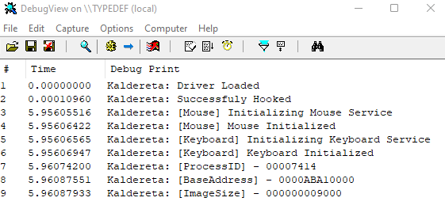

    

<h1 align="center">Kaldereta</h1>

    Unsigned Kernel Mode Driver that does memory modifications

## Features

<ul>
    <li>get process id</li>
    <li>get base address of an image</li>
    <li>change protection of a memory region</li>
    <li>allocate memory region</li>
    <li>free memory</li>
    <li>read/write from address</li>
    <li>read/write from address with offset</li>
    <li>read from memory to buffer</li>
    <li>write to memory from buffer</li>
    <li>simulate mouse events</li>
    <li>simulate keyboard events</li>
    <li>pattern scan</li>
</ul>

## Setup

Install [Windows Driver Kit](https://docs.microsoft.com/en-us/windows-hardware/drivers/download-the-wdk)

Load .sys file with [KDMapper](https://github.com/TheCruZ/kdmapper)

## Support

If you need help with anything please contact us on [Discord](https://discord.gg/SgCePxdkYZ)

Want to donate? [https://www.buymeacoffee.com/stephenasuncion](https://www.buymeacoffee.com/stephenasuncion)

## License

[GNU General Public License v3.0](https://github.com/stephenasuncionDEV/kaldereta/blob/main/LICENSE)